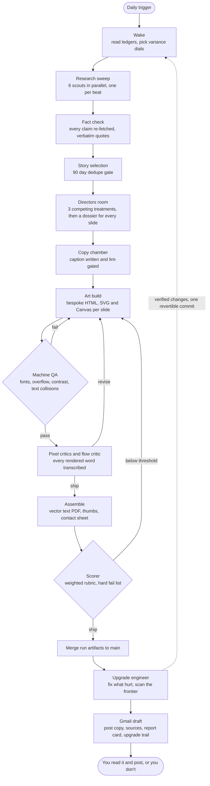

# Alaska.Ai Carousel Studio

This repo is an autonomous studio. Once a day it wakes up, finds the most
important Alaska and AI story it can verify, plans a LinkedIn carousel in
forensic detail, draws every slide with bespoke code, tears its own work
apart, and leaves a post-ready draft in Gmail. A person reads that draft
and decides whether it goes up. Nothing posts on its own.

It also maintains itself. After every run it studies what went wrong,
looks outside for better technique, and ships small verified upgrades to
its own machinery. Those changes ride along in the daily email, so you
can watch the machine evolve from your inbox and roll back whatever made
it worse.

## The pipeline



The dotted edge is the part that compounds. The upgrade engineer runs on
the strongest model available, diffs the run against the spec, and gets a
small budget of changes per day. Fixes for real defects come first. When
there is room left it applies what its frontier scan found, a timeboxed
web search across a rotating set of craft areas, from LinkedIn algorithm
shifts to news-graphics technique. Anything promising but risky gets
parked in the field notes instead of forced in. It can tighten gates but
never loosen them.

## Running it

The schedule, model and connectors live in the routine trigger at
claude.ai/code/routines. The trigger prompt is `prompts/ROUTINE_PROMPT.txt`
and it defers entirely to `prompts/routine_instructions.md`, which is the
single source of truth for run behavior.

Each run lands its artifacts in `runs/<date>/` on `main`. The Gmail draft
links to them, carries paste-ready post copy and a sources block for the
first comment, and includes the scorer's honest report card. Drafts
arrive daily. Posting cadence is yours.

If you want to feed results back, drop a line in the `outcome_notes`
field of `ledger/topics.json` or just tell the next run in its trigger
text. The instincts ledger absorbs it.

## What is where

The knowledge base under `knowledge/` is the studio brain. It holds the
LinkedIn performance science, the visual doctrine, an 80 plus entry
technique library, the slide dossier spec and the living field notes.
Config under `config/` sets the voice, the source seeds and the scoring
rubric. The four ledgers under `ledger/` remember topics, artwork
variety, confidence-scored instincts and every automation upgrade ever
made. The engine under `.claude/skills/carousel-engine/` renders slides
deterministically and runs the objective gates. Committed art libraries
and true lon/lat Alaska geodata live in `assets/`. Shipped work is in
`runs/` and per-run scratch stays in the gitignored `out/`.

## Working on the engine

```
bash .claude/skills/carousel-engine/bootstrap.sh
python .claude/skills/carousel-engine/render.py --slides-dir examples/demo-deck/slides --out-dir out/smoke/render
python .claude/skills/carousel-engine/qa.py --render-dir out/smoke/render
python .claude/skills/carousel-engine/assemble.py --slides-dir examples/demo-deck/slides --render-dir out/smoke/render --out-dir out/smoke/final --title "Engine Proof"
```

`CLAUDE.md` carries the authoritative delivery and merge policy plus the
house rules that never bend. No em dashes, no emojis, every fact carries
a claim id, no topic repeats inside 90 days, no two decks alike, honest
scores, honest emails.
